<!-- README.md is generated from README.Rmd. Please edit that file -->

# Run reconstruction using skrunchy package

<!-- badges: start -->

<!-- badges: end -->

See package
[skrunchy](https://github.com/Pacific-salmon-assess/skrunchy) -
**Sk**eena River **Run** Reconstruction for **Ch**inook Salmon - for
detailed methods and functions.

The goal of skrunchy is to recreate and update the run reconstruction
for Skeena River summer run timing Chinook upstream of Tyee test fishery
(aggregate plus six Conservation Units), as documented in [Winther et
al. 2024](https://publications.gc.ca/site/eng/9.901355/publication.html "An assessment of Skeena River Chinook salmon using genetic stock identification 1984 to 2020").

[This methods
document](https://github.com/Pacific-salmon-assess/skrunchy/blob/1296a4d8effdc5d75e464436b5d2861e2915f3bf/methods.pdf)
contains detailed methods, variables, and equations matching this
package as much as possible.

## General methods

Here, we take a known abundance of population (in this case,
Kitsumkalum) $K$ and expand it to estimate an aggregate population size
$X_{aggregate}$ using the proportion of fish from population $K$ in a
mixed genetic sample, $P_K$:

$$X_{aggregate} = \frac{K}{P_K}$$

Further, the abundance of other populations $X_i$ can be estimated using
their genetic proportion $P_i$ and the aggregate abundance
$X_{aggregate}$:

$$X_i = X_{aggregate} \cdot P_i$$

After that, the run is “reconstructed”: working backwards from
age-specific wild spawner abundance, all mortalities (brood stock
removals, fishery harvest, incidental mortality) are added back in, to
estimate total recruits produced by brood year. This produces estimates
of spawners and recruits by brood year, which can then be use to model
productivity.

## 

We can walk through all the functions with data saved in the ‘data/’
folder

Note that most of the package functions produce lists with two elements.
The first element is an array, and the second element is a data frame.
The array is used for subsequent analysis, and the data frame is useful
for plotting and producing report tables.

Use example data from Skeena Tyee test fishery weekly catch and genetic
mixture data, and pool it into annual genetic proportions.

``` r
library(skrunchy)
#> Loading required package: abind
#> Loading required package: here
#> here() starts at C:/github/skrunchy2025
#> Loading required package: zoo
#> 
#> Attaching package: 'zoo'
#> The following objects are masked from 'package:base':
#> 
#>     as.Date, as.Date.numeric
library(ggplot2)
library(latex2exp)
library(here)
library(dplyr)
#> 
#> Attaching package: 'dplyr'
#> The following objects are masked from 'package:stats':
#> 
#>     filter, lag
#> The following objects are masked from 'package:base':
#> 
#>     intersect, setdiff, setequal, union
options(scipen = 999)
devtools::load_all(".")
#> ℹ Loading skrunchy2025


P <- P

P_tilde <- get_P_tilde(P = P, sigma_P = sigma_P, G = G)

ggplot( P_tilde$df, aes(y = P_tilde, x = y, group = i)) +
  geom_errorbar( aes( ymin = P_tilde - sigma_P_tilde, ymax = P_tilde + sigma_P_tilde ), colour="dodgerblue") +
  geom_point() +
  geom_line() +
  facet_wrap(~i, ncol=2) +
  ylab(TeX("$\\tilde{P}$")) +
  geom_hline(aes(yintercept=0)) +
  theme_classic() 
```

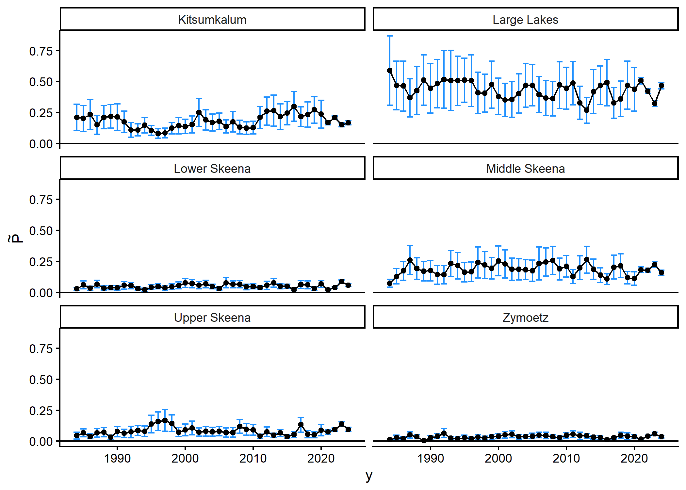

Now do expansions to get returns to Terrace for each population, and the
Skeena aggregate.

``` r
k <- kitsumkalum[ kitsumkalum$year <= 2024, ]
X <- get_X(P_tilde = P_tilde$P_tilde, sigma_P_tilde = P_tilde$sigma_P_tilde, K= k$kitsumkalum_escapement, 
           sigma_K = k$sd,
           y_K = k$year)

ggplot( X$df, aes(y = X, x = y, group = i)) +
  geom_errorbar( aes( ymin = X - sigma_X, ymax = X + sigma_X)) +
  geom_point() +
  geom_line() +
  facet_wrap(~i, ncol=2, scales = "free_y") +
  geom_hline(aes(yintercept=0)) +
  theme_classic()
```

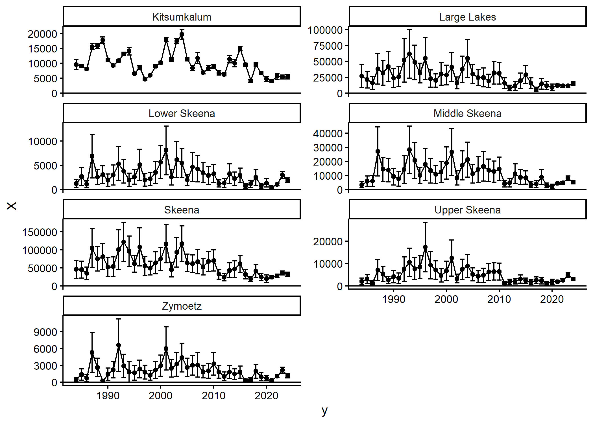

Estimate terminal mortalities, total by year

Get age proportions by age, population and year, including jacks.

Note higher jack proportion in recent years.

``` r
omega_J_all <- omega_J
omega_J_skeena <- omega_J$omega["Skeena",,] # only include Skeena

ggplot( omega_J_all$df[ omega_J_all$df$i == "Skeena", ], aes(y = omega, x = y, group = i)) +
  geom_point() + 
  geom_line() + 
  geom_hline(aes(yintercept=0)) + 
  ylab(TeX("$\\Omega_J$") )+
  facet_grid( i ~ a ) + 
  theme_classic() +
  theme(axis.text.x = element_text(angle=90, vjust=0.5),
        strip.text.y = element_text(angle = 0))
```

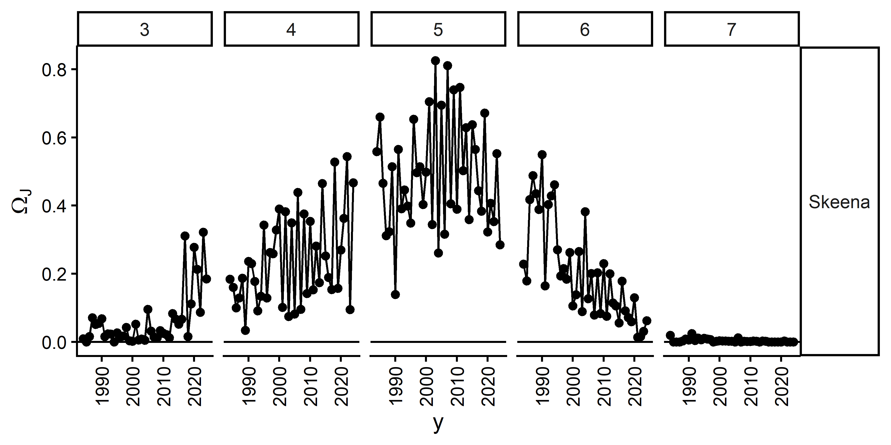

Get freshwater terminal mortalities in the lower Skeena by year

``` r

Tau_L_total <- get_Tau_L_total( omega_J = omega_J_skeena, tyee = Tau$tyee, 
                                rec_catch_L = Tau$rec_catch_L,
                                rec_release_L = Tau$rec_release_L, 
                                FN_catch_L = Tau$FN_catch_L)

Tau_L_total_df <- data.frame( "Tau_L_total" = Tau_L_total, y = as.integer(names(Tau_L_total)))

ggplot( Tau_L_total_df, aes(y = Tau_L_total, x = y, group = 1)) +
  geom_line() + 
  geom_point() + 
  geom_hline(aes(yintercept=0)) + 
  ylab(TeX("$T_L$") )+
  theme_classic() +
  theme(axis.text.x = element_text(angle=90, vjust=0.5),
        strip.text.y = element_text(angle = 0))
```

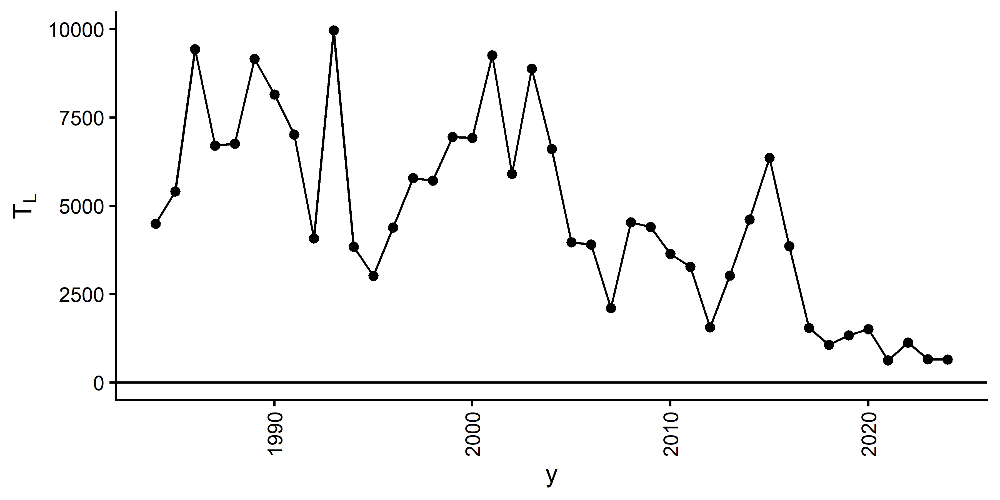

Get freshwater terminal mortalities in the upper Skeena by year

``` r
Tau_U_total <- get_Tau_U_total( omega_J = omega_J_skeena, rec_catch_U = Tau$rec_catch_U,
                                   FN_catch_U = Tau$FN_catch_U)
Tau_U_total_df <- data.frame(Tau_U_total, y = as.integer(names(Tau_U_total) ))
ggplot( Tau_U_total_df, aes(y = Tau_U_total, x = y, group = 1)) +
  geom_point() + 
  geom_line() + 
  geom_hline(aes(yintercept=0)) + 
  ylab(TeX("$T_U$") )+
  theme_classic() +
  theme(axis.text.x = element_text(angle=90, vjust=0.5),
        strip.text.y = element_text(angle = 0))
```

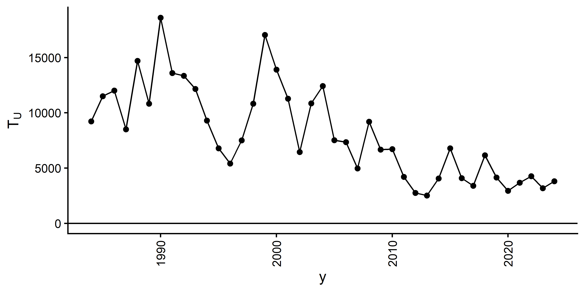

Get escapement for each population, plot with returns to Terrace (note,
will only be different for Skeena aggregate and the three upper
populations). See below for $T_U$ calculations.

``` r
E <- get_E(K = k$kitsumkalum_escapement, X = X$X, Tau_U = Tau_U_total,
     known_population = "Kitsumkalum",
     aggregate_population = "Skeena",
     lower_populations = c("Lower Skeena", "Zymoetz"),
     upper_populations = c("Upper Skeena", "Middle Skeena", "Large Lakes"))

ggplot(X$df, aes(y = X, x = y, group = i)) +
  geom_errorbar( aes( ymin = X - sigma_X, ymax = X + sigma_X)) +
  geom_point() +
  geom_line() +
  geom_line(data = E$df, aes(y = E, x = y, group=i), colour="gray") +
  facet_wrap(~i, ncol=2, scales = "free_y") +
  ylab("Return to Terrace (X) in black, escapement (E) in gray") +
  geom_hline(aes(yintercept=0)) +
  theme_classic()
```

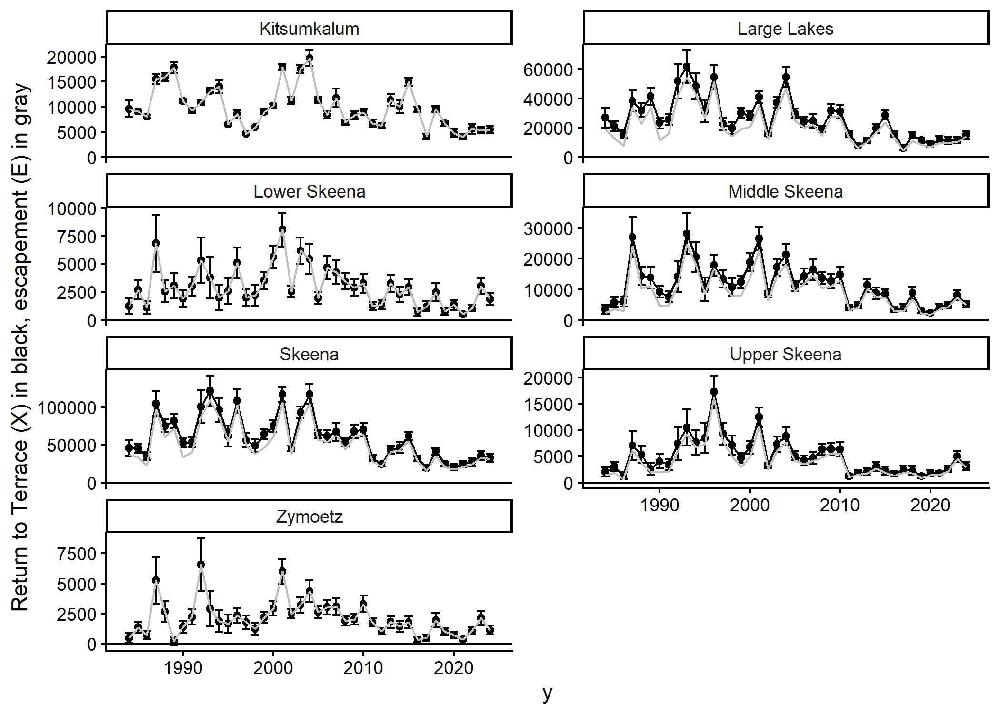

Get age proportions by age, population and year (fake data).

``` r
omega <- omega

ggplot( omega$df, aes(y = omega, x = y, group = i)) +
  geom_point() + 
  geom_line() + 
  geom_hline(aes(yintercept=0)) + 
  ylab(TeX("$\\Omega$") )+
  facet_grid( i ~ a ) + 
  theme_classic() +
  theme(axis.text.x = element_text(angle=90, vjust=0.5),
        strip.text.y = element_text(angle = 0))
```

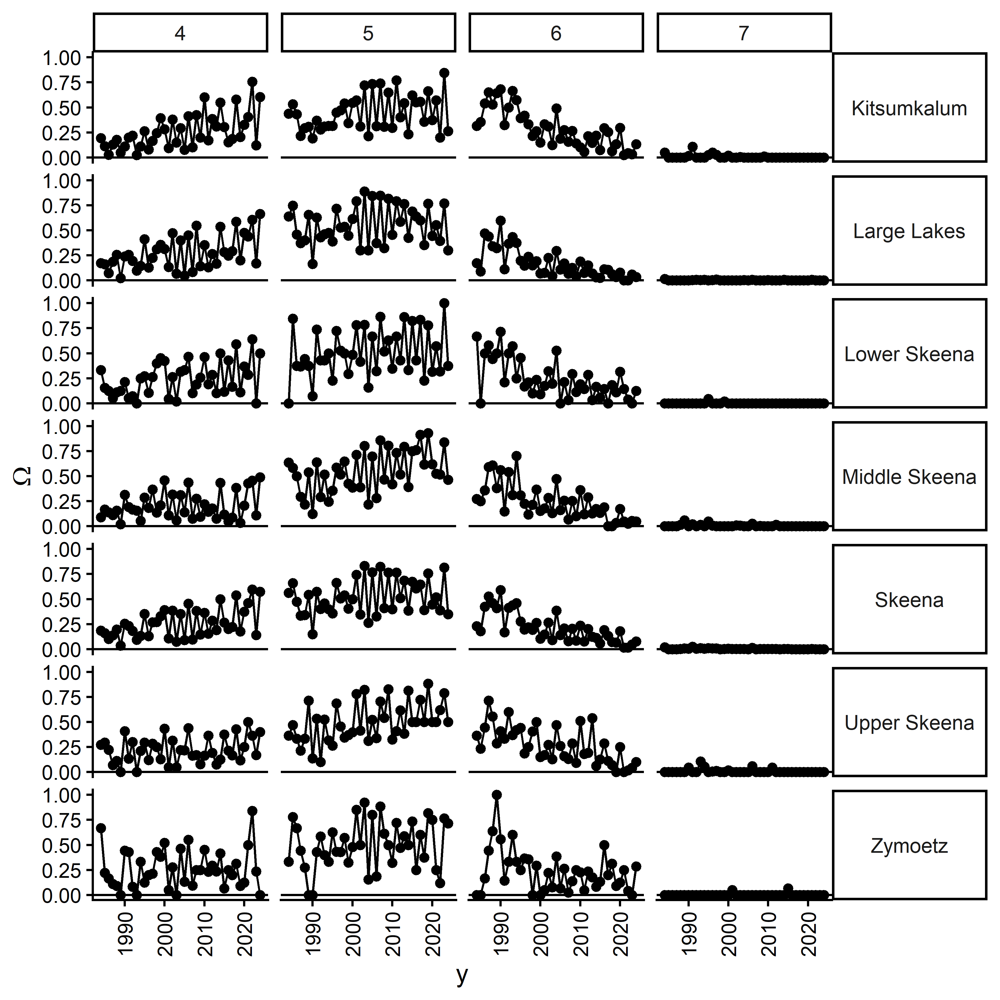

Get age-specific escapement for Kitsumkalum River, from sex-specific age
proportions, sex-specific escapement, and hatchery contributions.

``` r
K_star <- get_K_star( K = k$kitsumkalum_escapement, y_K = k$year, 
                      K_M = k$male_escapement, K_F = k$female_escapement, 
                      omega_KM = omega_K[ "M",,  ], omega_KF = omega_K[ "F",, ], 
                      H = H, H_star = H_star)

ggplot(K_star$df, aes(y = K_star, x = y, group= a )) +
  geom_point() +
  geom_line() +
  facet_wrap(~a, ncol=2 ) +
  ylab(TeX("Kitsumkalum escapement by age ($K^*$)") ) +
  geom_hline(aes(yintercept=0)) +
  theme_classic()
```

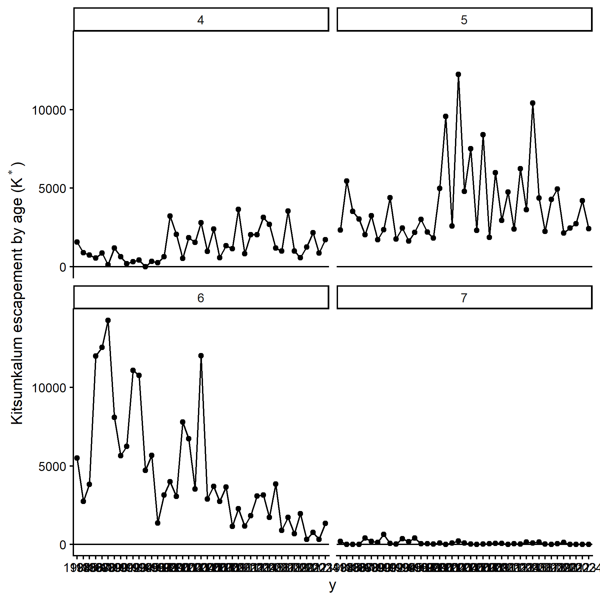

Get age-specific escapement by using age proportions.

``` r
E_star <- get_E_star(E = E$E, omega = omega$omega, K_star = K_star$K_star, add_6_7 = TRUE)

ggplot( E_star$df, aes(y = E_star, x = y, group = i)) +
  geom_point( colour="gray") + 
  geom_line( colour="gray") + 
  geom_hline(aes(yintercept=0)) + 
  facet_grid( i ~ a , scales = "free_y") + 
  ylab("Escapement (E*)") +
  theme_classic() +
  theme(axis.text.x = element_text(angle=90, vjust=0.5),
        strip.text.y = element_text(angle = 0))
```

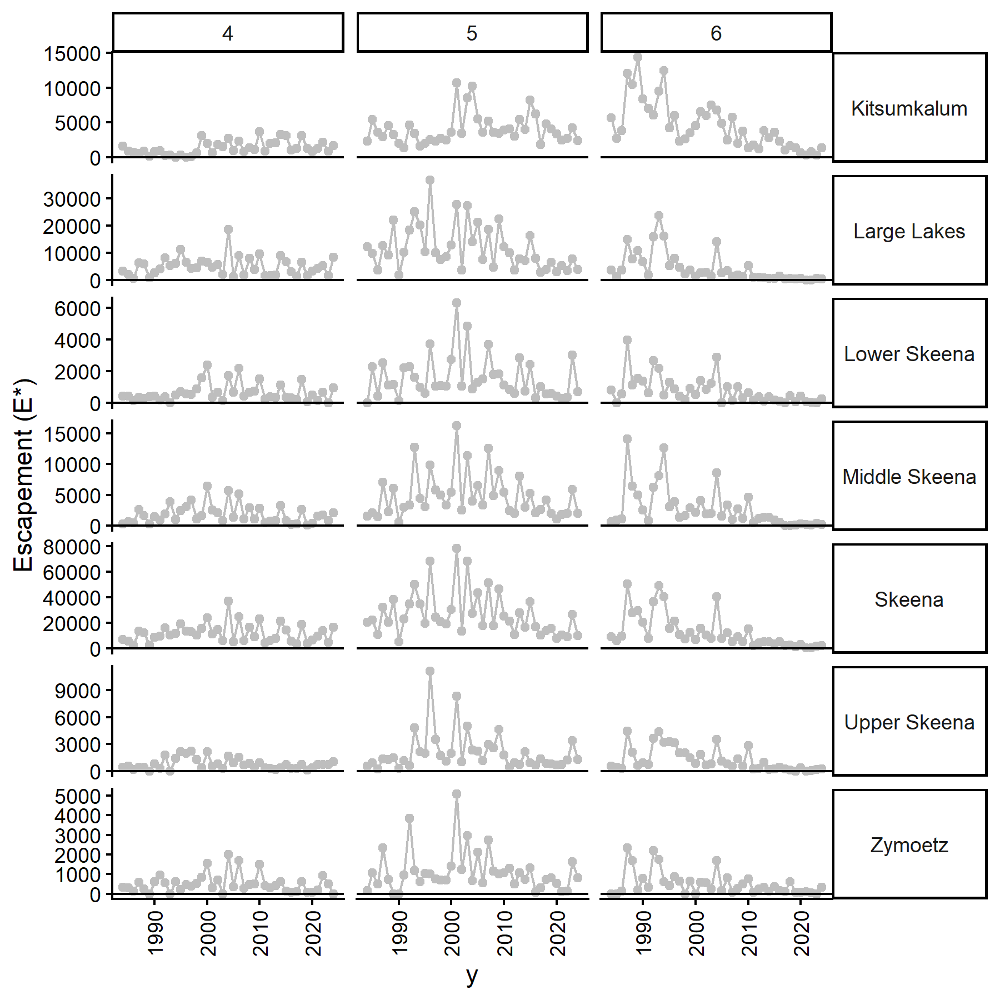

Get spawners for each population (accounts for brood stock removals),
plot with returns to Terrace and escapement. Spawners should only be
different from escapement for Skeena aggregate and Kitsumkalum, since
brood removals are only for Kitsumkalum.

``` r
S_star <- get_S_star(E_star = E_star$E_star, B_star = B_star)

ggplot( E_star$df, aes(y = E_star, x = y, group = i)) +
  geom_point(colour="gray") + 
  geom_line(colour="gray") + 
  geom_line(data = S_star$df, aes(y = S_star, x = y, group = i), colour="dodgerblue") +
  geom_hline(aes(yintercept=0)) + 
  facet_grid( i ~ a , scales = "free_y") + 
  ylab("Escapement (E*) in gray and spawners (S*) in blue") +
  theme_classic() +
  theme(axis.text.x = element_text(angle=90, vjust=0.5),
        strip.text.y = element_text(angle = 0))
```

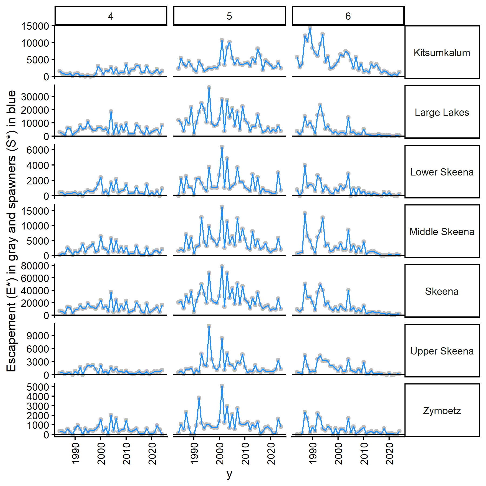

Get wild spawners for each population (accounts for hatchery origin
spawners), plot with returns to Terrace, escapement, and spawners. Wild
spawners should only be different from spawners for Skeena aggregate and
Kitsumkalum, since hatchery origin spawners only occur for Kitsumkalum.

``` r
W_star <- get_W_star( S_star = S_star$S_star, H_star = H_star) 

ggplot( E_star$df, aes(y = E_star, x = y, group = i)) +
  geom_point(colour="gray") + 
  geom_line(colour="gray") + 
  geom_line(data = W_star$df, aes(y = W_star, x = y, group = i), colour="firebrick") +
  geom_line(data = S_star$df, aes(y = S_star, x = y, group = i), colour="dodgerblue") +
  geom_hline(aes(yintercept=0)) + 
  facet_grid( i ~ a , scales = "free_y") + 
  ylab("Escapement (E*) in gray, spawners (S*) in blue,\nand wild spawners (W*) in red.") +
  theme_classic() +
  theme(axis.text.x = element_text(angle=90, vjust=0.5),
        strip.text.y = element_text(angle = 0))
```

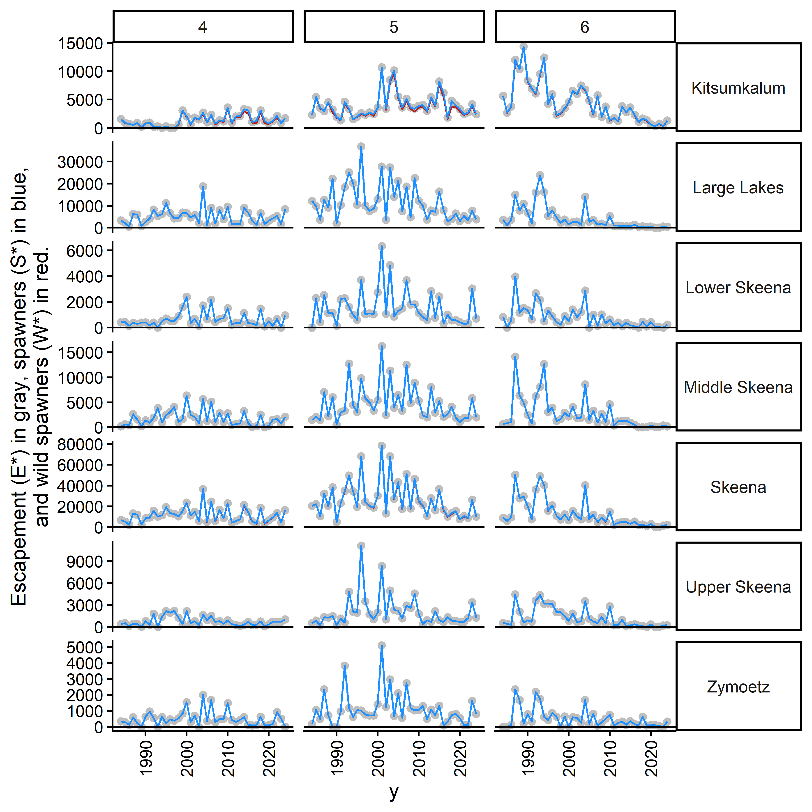

Get proportion wild spawners for each population and plot. Should only
be \<1 for Skeena aggregate and Kitsumkalum, since hatchery origin
spawners only occur for Kitsumkalum. Note this is not real data, p is
very high for Kitsumkalum across years.

``` r
p <- get_p(W_star = W_star$W_star, E_star = E_star$E_star, B_star = B_star)

ggplot(p$df, aes(y = p, x = y, group = i)) +
  geom_point() +
  geom_line() +
  facet_grid(i~a) +
  ylab("Proportion wild spawners, p") +
  geom_hline(aes(yintercept=0)) +
  theme_classic()+
  theme(axis.text.x = element_text(angle=90, vjust=0.5),
        strip.text.y = element_text(angle = 0))
```

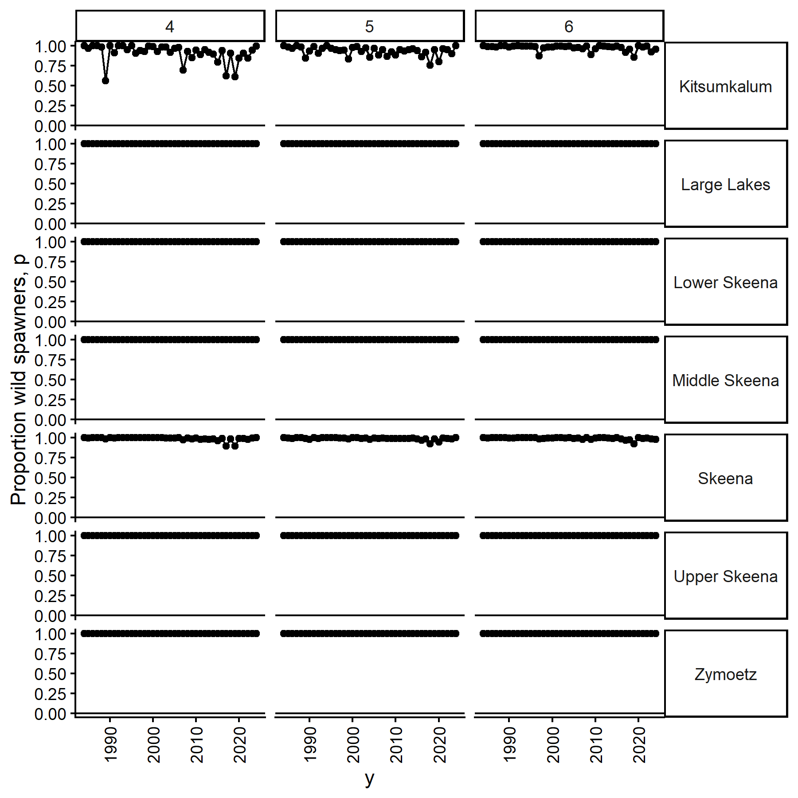

Estimate freshwater terminal mortalities in the lower Skeena by
population, year, and age.

``` r
tau_L <- get_tau_L(Tau_L = Tau_L_total, omega = omega$omega, P_tilde = P_tilde$P_tilde, aggregate_population = "Skeena", add_6_7 = TRUE)

ggplot( tau_L$df , aes(y =tau_L, x = y, group = i)) +
  geom_point() + 
  geom_line() + 
  geom_hline(aes(yintercept=0)) + 
  ylab(TeX("$\\tau_L$")) +
  facet_grid( i ~ a, scales="free_y") + 
  theme_classic() +
  theme(axis.text.x = element_text(angle=90, vjust=0.5),
        strip.text.y = element_text(angle = 0))
```

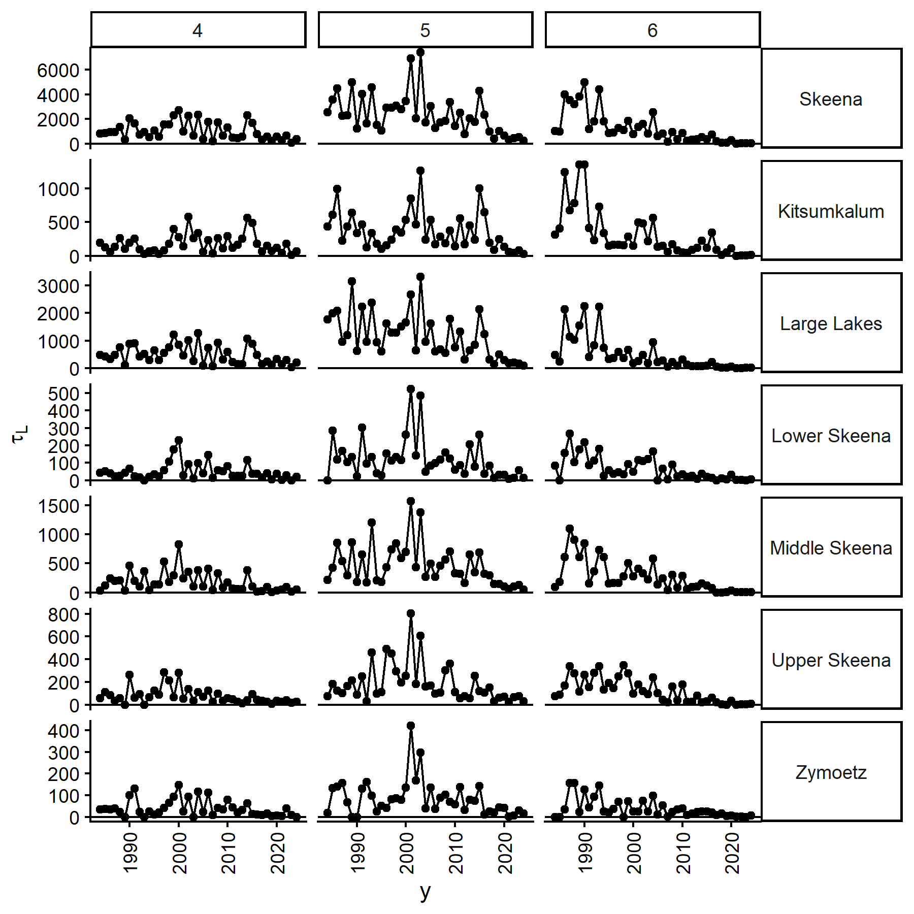

Estimate freshwater terminal mortalities in the upper Skeena by
population, year, and age. Should be 0 for Kitsumkalum, Lower Skeena,
and Zymoetz-Fiddler.

``` r
tau_U <- get_tau_U(Tau_U = Tau_U_total, omega = omega$omega, P_tilde = P_tilde$P_tilde, aggregate_population = "Skeena",
                   upper_populations = c("Middle Skeena", "Large Lakes", "Upper Skeena"),
    lower_populations = c("Lower Skeena", "Kitsumkalum", "Zymoetz"), add_6_7 = TRUE)

ggplot( tau_U$df, aes(y =tau_U, x = y, group = i)) +
  geom_point() + 
  geom_line() + 
  geom_hline(aes(yintercept=0)) + 
  ylab(TeX("$\\tau_U$")) +
  facet_grid( i ~ a) + 
  theme_classic() +
  theme(axis.text.x = element_text(angle=90, vjust=0.5),
        strip.text.y = element_text(angle = 0))
```

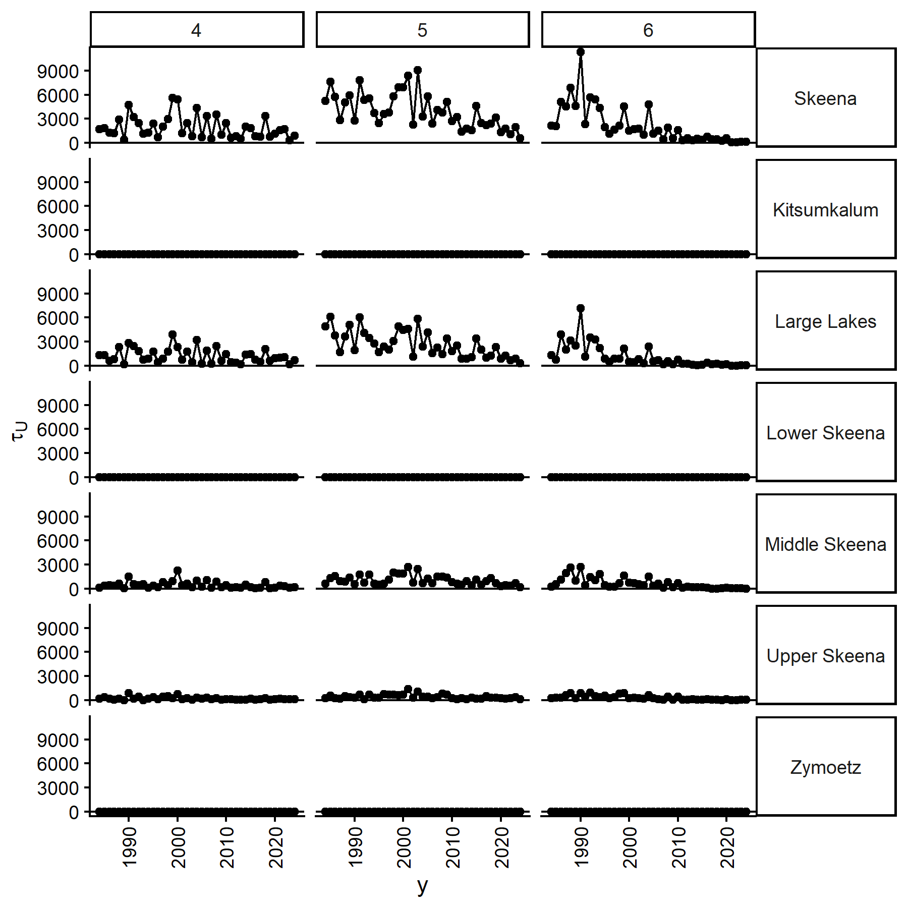

Estimate marine terminal mortalities in the marine area by population,
year, and age.

``` r
tau_M <- get_tau_M( W_star = W_star$W_star, tau_dot_M = tau_dot_M)

ggplot( tau_M$df, aes(y =tau_M, x = y, group = i)) +
  geom_point() + 
  geom_line() + 
  geom_hline(aes(yintercept=0)) + 
  ylab(TeX("$\\tau_M$")) +
  facet_grid( i ~ a, scales="free_y") + 
  theme_classic() +
  theme(axis.text.x = element_text(angle=90, vjust=0.5),
        strip.text.y = element_text(angle = 0))
```

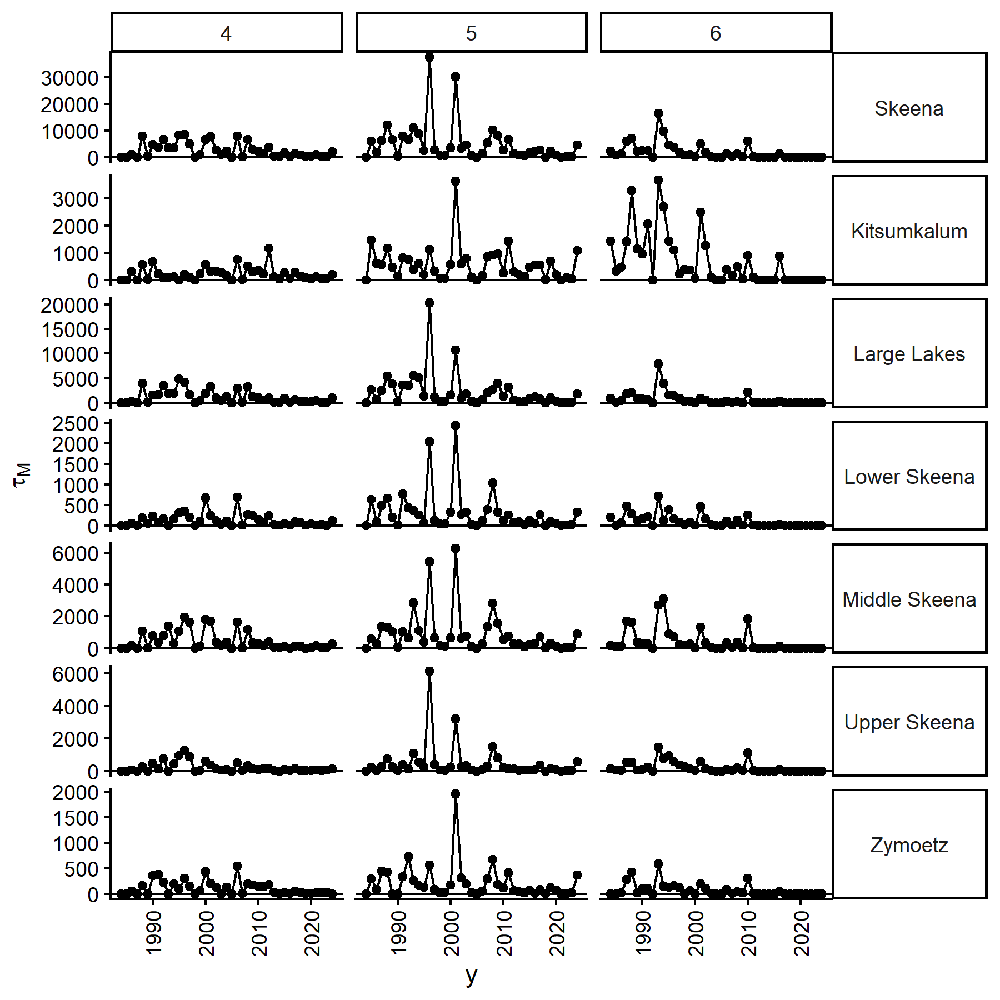

<!-- Get total terminal mortality  -->

<!-- ```{r tau, dpi=300, fig.width = w,fig.height=h} -->

<!-- tau <- get_tau(tau_U = tau_U$tau_U, tau_L = tau_L$tau_L, tau_M= tau_M$tau_M) -->

<!-- ggplot( tau$df, aes(y =tau, x = y, group = i)) + -->

<!--   geom_line() + -->

<!--   geom_point() + -->

<!--   geom_line( data = tau_L$df, aes(y =tau_L, x = y), colour="goldenrod") + -->

<!--   geom_line( data = tau_U$df, aes(y =tau_U, x = y), colour="aquamarine") + -->

<!--   geom_line( data = tau_M$df, aes(y =tau_M, x = y), colour="blue") + -->

<!--   geom_hline(aes(yintercept=0)) +  -->

<!--   ylab(TeX("$\\tau$")) + -->

<!--   facet_grid( i ~ a, scales="free_y") +  -->

<!--   theme_classic() + -->

<!--   theme(axis.text.x = element_text(angle=90, vjust=0.5), -->

<!--         strip.text.y = element_text(angle = 0)) -->

<!-- ``` -->

Get wild total terminal mortality

``` r
tau_W <- get_tau_W(tau_U= tau_U$tau_U, tau_L = tau_L$tau_L, tau_M = tau_M$tau_M, p = p$p)

ggplot( tau_W$df, aes(y =tau_W, x = y, group = i)) +
  geom_line() +
  geom_point() +
  geom_hline(aes(yintercept=0)) + 
  geom_line( data = tau_L$df, aes(y =tau_L, x = y), colour="goldenrod") + 
  geom_line( data = tau_U$df, aes(y =tau_U, x = y), colour="aquamarine") + 
  geom_line( data = tau_M$df, aes(y =tau_M, x = y), colour="blue") + 
  ylab(TeX("$\\tau_W$ in black")) +
  facet_grid( i ~ a, scales="free_y") + 
  theme_classic() +
  theme(axis.text.x = element_text(angle=90, vjust=0.5),
        strip.text.y = element_text(angle = 0))
```

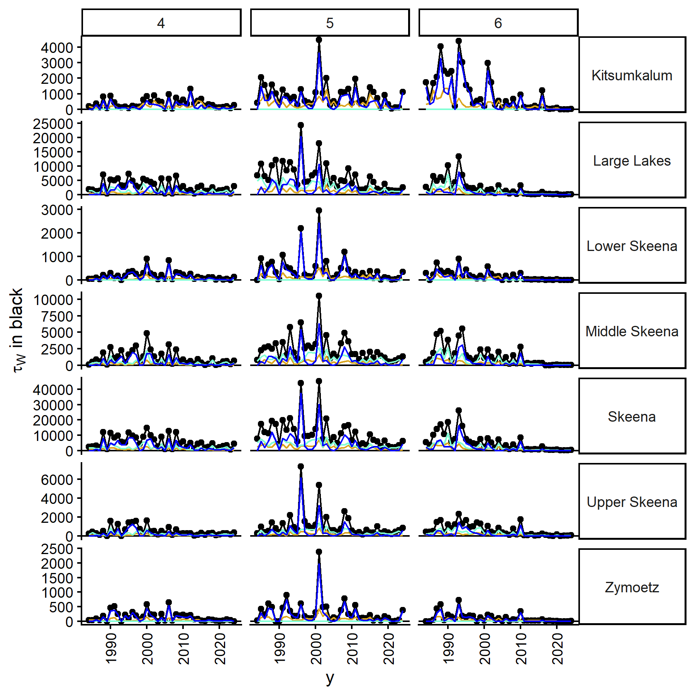

Get wild terminal run

``` r
TermRun <- get_TermRun(tau_W = tau_W$tau_W, W_star = W_star$W_star, B_star = B_star)

ggplot( TermRun$df, aes(y =TermRun, x = y, group = i)) +
  geom_line() +
  geom_point() +
  geom_line( data = tau_W$df, aes(y =tau_W, x = y), colour="darkorange3") +
  geom_line( data = W_star$df, aes(y =W_star, x = y), colour="firebrick") +
  geom_hline(aes(yintercept=0)) + 
  ylab(TeX("$TermRun$ in black, $\\tau_W$ in orange, and $W^*$ in red")) +
  facet_grid( i ~ a, scales="free_y") + 
  theme_classic() +
  theme(axis.text.x = element_text(angle=90, vjust=0.5),
        strip.text.y = element_text(angle = 0))
```

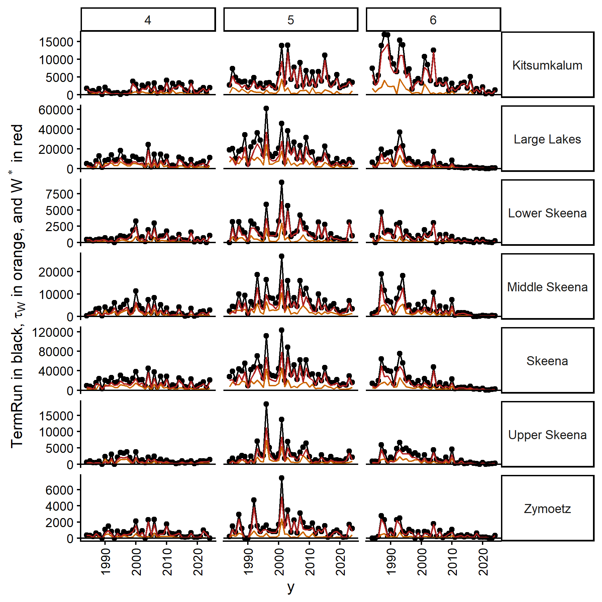

Get mature run

``` r
MatureRun <- get_MatureRun(TermRun = TermRun$TermRun, phi_dot_M = phi_dot_M)

ggplot( MatureRun$df, aes(y =MatureRun, x = y, group = i)) +
  geom_line(colour="darkgreen") +
  geom_point(colour ="darkgreen") +
  geom_line( data = TermRun$df, aes(y =TermRun, x = y, group = i), colour="black") +
  geom_hline(aes(yintercept=0)) + 
  ylab(TeX("$MatureRun$ in green, $TermRun$ in black")) +
  facet_grid( i ~ a, scales="free_y") + 
  theme_classic() +
  theme(axis.text.x = element_text(angle=90, vjust=0.5),
        strip.text.y = element_text(angle = 0))
```

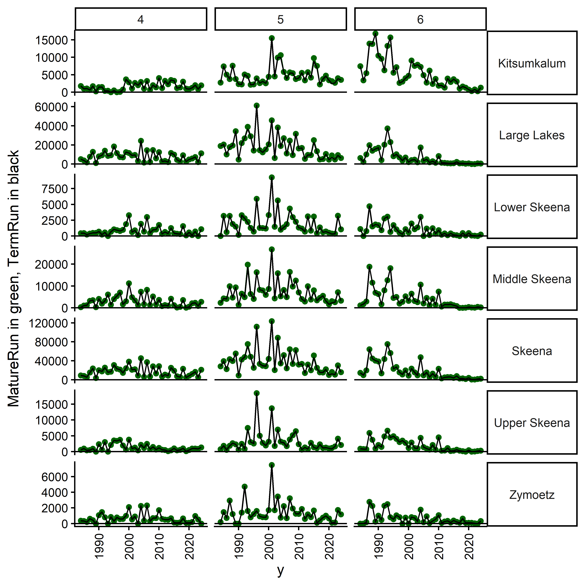

Pre-terminal post fishery abundance.

``` r
# Quick fix for r, age 4, year = 2003, very low
r[ "2003", "4"] <- mean(r [ as.character(c(2001:2002, 2004:2005)) , "4"])
A_phi <- get_A_phi( MatureRun = MatureRun$MatureRun, r = r)

ggplot( MatureRun$df, aes(y =MatureRun, x = y, group = i)) +
  geom_line(colour="darkgreen") +
  geom_point(colour ="darkgreen") +
  geom_line( data = A_phi$df, aes(y =A_phi, x = y, group = i), colour="dodgerblue") +
  geom_hline(aes(yintercept=0)) + 
  ylab(TeX("$MatureRun$ in green, $A_\\varphi$ in blue")) +
  facet_grid( i ~ a, scales="free_y") + 
  theme_classic() +
  theme(axis.text.x = element_text(angle=90, vjust=0.5),
        strip.text.y = element_text(angle = 0))
```

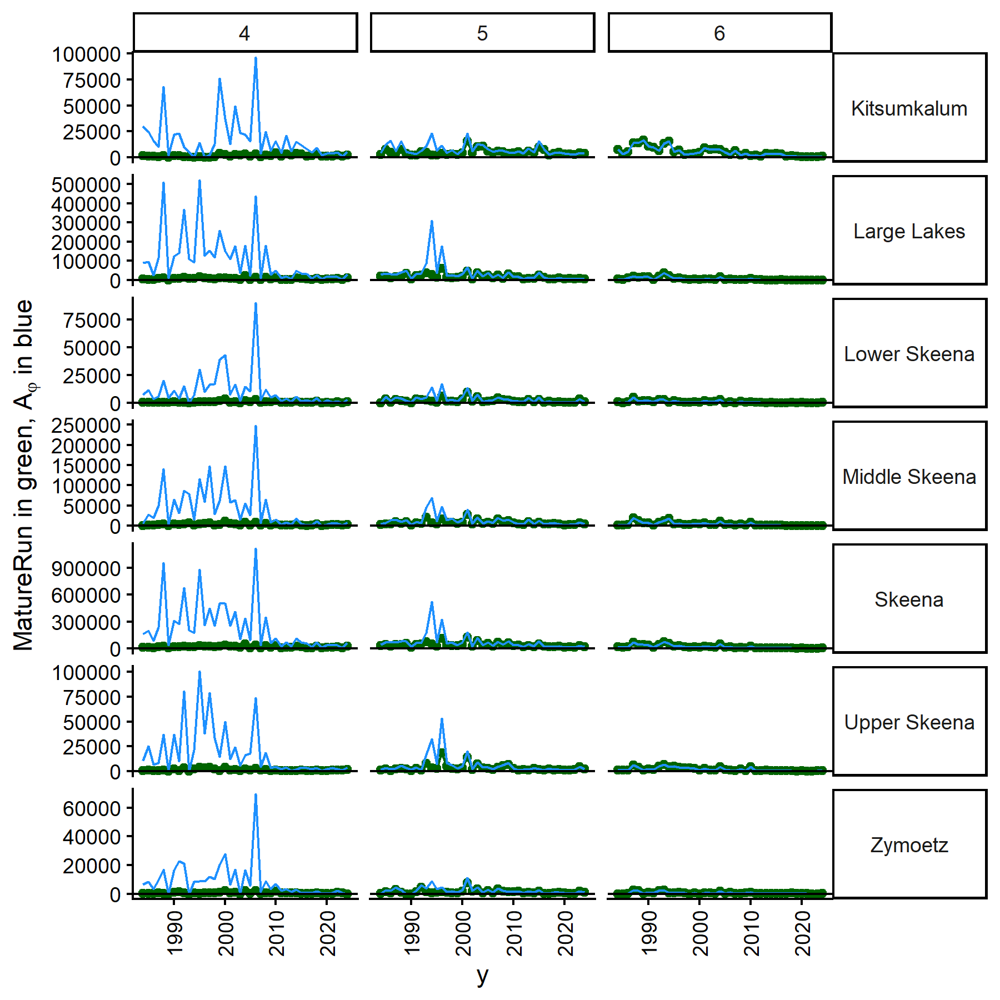 Pre-fishery
ocean abundance.

``` r
A_P <- get_A_P( A_phi = A_phi$A_phi, phi_dot_E = phi_dot_E)

ggplot( A_phi$df, aes(y = A_phi, x = y, group = i)) +
  geom_line(colour="dodgerblue") +
  #geom_point(colour ="dodgerblue") +
  geom_line( data = A_P$df, aes(y =A_P, x = y, group = i), colour="darkorange") +
  geom_hline(aes(yintercept=0)) + 
  ylab(TeX("Pre-fishery ocean abundance $A_P$ in orange, $A_\\varphi$ in blue")) +
  facet_grid( i ~ a, scales="free_y") + 
  theme_classic() +
  theme(axis.text.x = element_text(angle=90, vjust=0.5),
        strip.text.y = element_text(angle = 0))
```

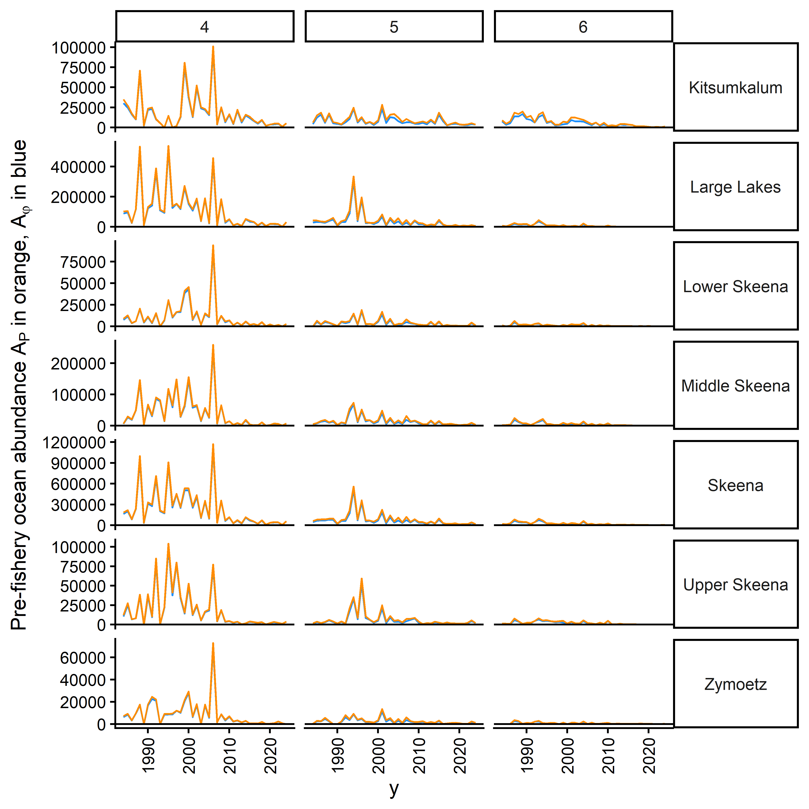

Preterminal fishing mortality in nominal fish.

``` r
phi_N <- get_phi_N( A_P = A_P$A_P, A_phi = A_phi$A_phi)

ggplot( phi_N$df, aes(y = phi_N, x = y, group = i)) +
  geom_line() +
  geom_point() +
  geom_hline(aes(yintercept=0)) + 
  ylab(TeX("Preterminal fishing mortality in nominal fish, $\\varphi_N$")) +
  facet_grid( i ~ a, scales="free_y") + 
  theme_classic() +
  theme(axis.text.x = element_text(angle=90, vjust=0.5),
        strip.text.y = element_text( angle = 0))
```

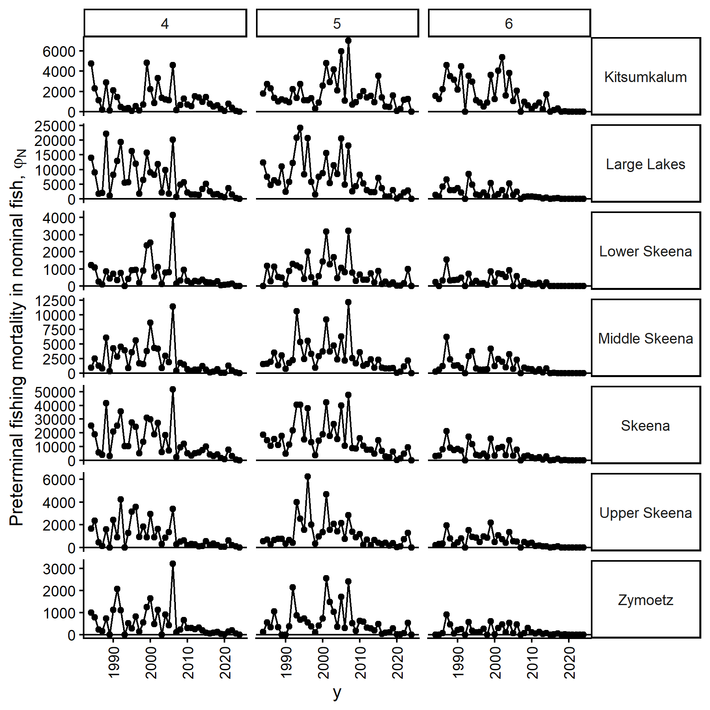

Preterminal fishing mortality in adult equivalents.

``` r
phi_Q <- get_phi_Q( phi_N = phi_N$phi_N, Q = Q)

ggplot( phi_N$df, aes(y = phi_N, x = y, group = i)) +
  geom_line() +
  geom_point() +
  geom_line(data = phi_Q$df, aes( y= phi_Q, x = y), colour="darkorchid1")+
  geom_hline(aes(yintercept=0)) +
  ylab(TeX("Preterminal fishing mortality in adults equivalents $\\varphi_Q$ in purple. $\\varphi_N$ in black")) +
  facet_grid( i ~ a, scales="free_y") +
  theme_classic() +
  theme(axis.text.x = element_text(angle=90, vjust=0.5),
        strip.text.y = element_text(angle = 0))
```

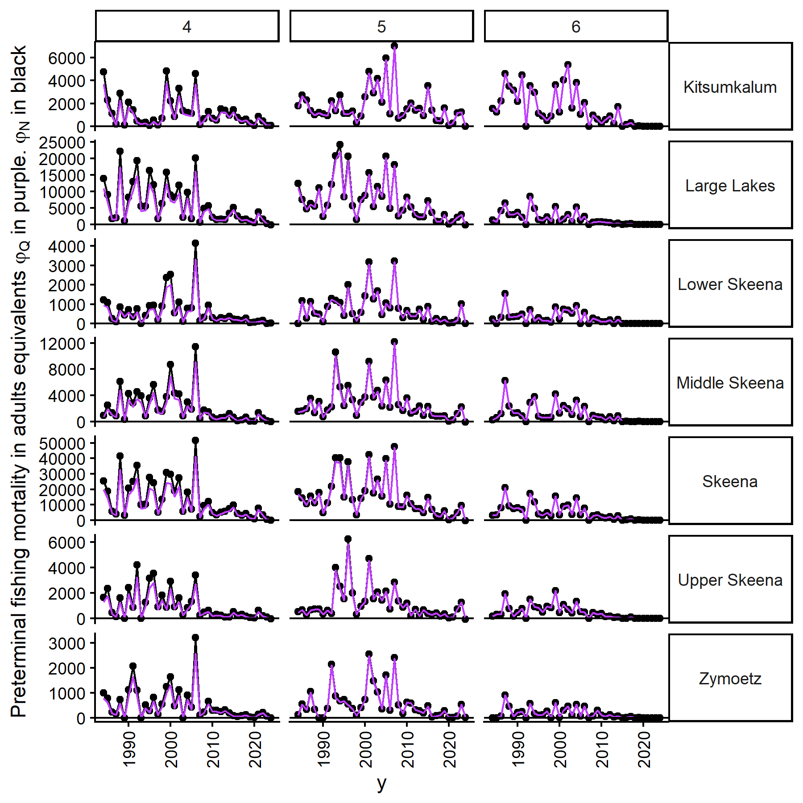

Recruits by return year and brood year.

``` r
R_star <- get_R_star( MatureRun = MatureRun$MatureRun, phi_Q = phi_Q$phi_Q)

ggplot( R_star$df, aes(y = R_star, x = y, group = i)) +
  geom_line() +
  geom_point() +
  geom_line(data = phi_Q$df, aes( y= phi_Q, x = y), colour="darkorchid1")+
  geom_line(data = MatureRun$df, aes(y = MatureRun, x = y), colour = "darkgreen") +
  geom_hline(aes(yintercept=0)) +
  ylab(TeX("$R^*$ in black, $MatureRun$ in green, $\\varphi_Q$ in pink")) +
  facet_grid( i ~ a, scales="free_y") +
  theme_classic() +
  theme(axis.text.x = element_text(angle=90, vjust=0.5),
        strip.text.y = element_text(angle = 0))
```

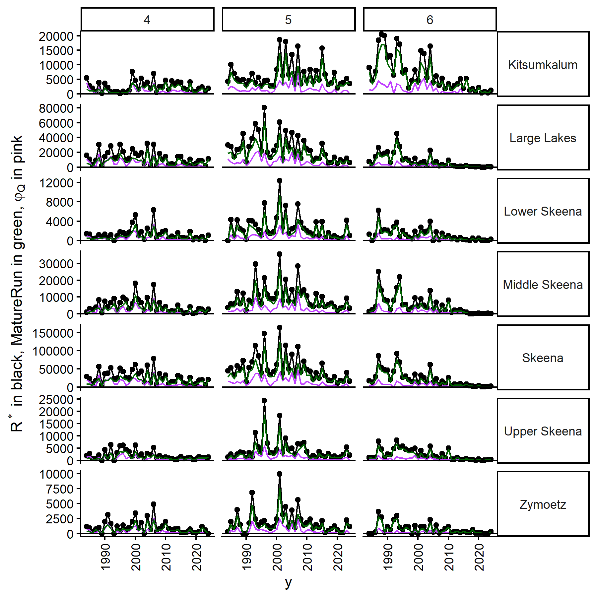

``` r

ggplot( R_star$df, aes(y = R_star, x = b, group = i, colour= complete_brood)) +
  geom_line() +
  geom_point() +
  geom_hline(aes(yintercept=0)) +
  xlab("Brood year") +
  ylab(TeX("$R^*$ by brood year.")) +
  facet_grid( i ~ a, scales="free_y") +
  scale_colour_manual(values = c("gray", "black")) +
  theme_classic() +
  theme(axis.text.x = element_text(angle=90, vjust=0.5),
        strip.text.y = element_text(angle = 0))
```

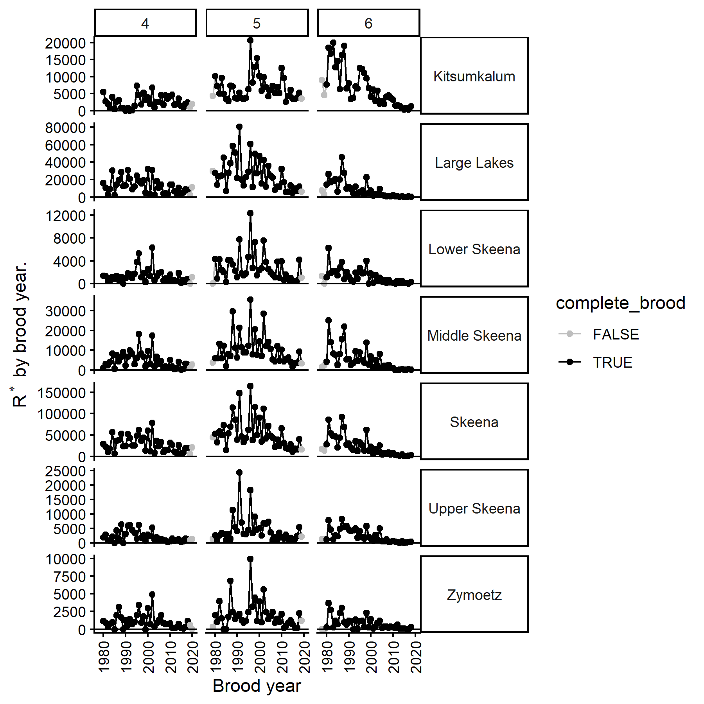

Get recruits by brood year, summed across ages.

``` r
R <- get_R( R_star_b = R_star$R_star_b, R_star_df = R_star$df)

ggplot( R$df, aes(y = R, x = b, group = i, colour = complete_brood)) +
  geom_line() +
  geom_point() +
  geom_hline(aes(yintercept=0)) +
  ylab(TeX("Recruits, $R$")) +
  xlab("Brood year") +
  facet_wrap( ~i , scales="free_y") +
  scale_colour_manual(values = c("gray", "black")) +
  theme_classic() +
  theme(axis.text.x = element_text(angle=90, vjust=0.5))
```

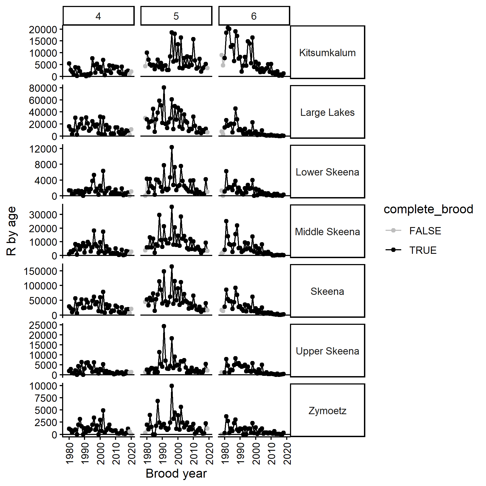

``` r


# Save generated data files to data/ folder
usethis::use_data(P_tilde, overwrite= TRUE)
#> ✔ Setting active project to "C:/github/skrunchy2025".
#> ✔ Saving "P_tilde" to "data/P_tilde.rda".
#> ☐ Document your data (see <https://r-pkgs.org/data.html>).
usethis::use_data(W_star, overwrite = TRUE)
#> ✔ Saving "W_star" to "data/W_star.rda".
#> ☐ Document your data (see <https://r-pkgs.org/data.html>).
usethis::use_data(R_star, overwrite = TRUE)
#> ✔ Saving "R_star" to "data/R_star.rda".
#> ☐ Document your data (see <https://r-pkgs.org/data.html>).
```

``` r

# Merge all data frames by the return year, age, and CU

combine_df_list <- function(x, includes_ages = TRUE) { 
  
  # remove brood year column before merging
  dn <- lapply(x, function(i) {
    df_new <- i[ , !grepl("^b$", names(i))]
    df_new
  } )
  
  if( includes_ages == TRUE) {
  combdf <- Reduce(function(d1, d2) {
    merge(d1, d2, by = c("y", "a", "i"), all = TRUE)
  }, dn)
    combdf$b <- combdf$y - combdf$a
  }
  
  if( includes_ages == FALSE) {
  combdf <- Reduce(function(d1, d2) {
    merge(d1, d2, by = c("y", "i"), all = TRUE)
  }, dn)
  }

  
  return(combdf)
}

# Make a data frame with brood stock removals, equal for Skeena and Kitsumkalum, 0 for all other CUs
B_star_df <-  array2DF( B_star, responseName = "B_star")

brood_pops <- c("Kitsumkalum", "Skeena")
CU_dummy <-  expand.grid( brood_pops, unique(B_star_df$y), unique(B_star_df$a) ) 
names(CU_dummy) <- c("i", "y", "a")
CU_dummy2 <-  expand.grid( unique(X$df$i)[ !unique(X$df$i) %in% brood_pops], unique(B_star_df$y), unique(B_star_df$a) ) 
names(CU_dummy2) <- c("i", "y", "a")
CU_dummy2$B_star <- 0

B_star_df1 <- merge(B_star_df, CU_dummy, by = c("y", "a"), all = TRUE)
B_star_df2 <- rbind( B_star_df1, CU_dummy2)
# ggplot( B_star_df2, aes ( y = B_star, x  = y)) + 
#   geom_line()+ geom_point() + 
#   facet_grid( i ~ a) + 
#   theme_classic() 


list_df_iya <- list( omega$df,
                     B_star_df2,
                 #"n" = n # n age observations, would need to make into df
                 p$df,
                 E_star$df, 
                 W_star$df,
                 tau_L$df,
                 tau_U$df,
                 tau_M$df,
                 tau_W$df,
                 TermRun$df,
                 MatureRun$df,
                 A_phi$df,
                 A_P$df,
                 phi_N$df,
                 phi_Q$df,
                 R_star$df )

#debugonce(combine_df_list)
dc <- combine_df_list(list_df_iya, includes_ages = TRUE)

list_df_iy <- list( P_tilde$df,
                        X$df, 
                        E$df)
#debugonce(combine_df_list)
dciy <- combine_df_list(list_df_iy, includes_ages = FALSE)


# ERA_l <- ERA_w %>% pivot_longer(., cols = 3:8, names_to = "var", values_to = "value")
# ERA_data_processed <- list( df_wide = ERA_w, df_long = ERA_l)
#names(ERA_data_processed)

dc$total_harvest_estimate <- dc$R_star - dc$W_star - dc$B_star
dc$total_run <- dc$R_star

variable_name_key
#>    skrunchy                   detail
#> 1    R_star                 recruits
#> 2    W_star            wild_spawners
#> 3    S_star           total_spawners
#> 4         b               brood_year
#> 5         y              return_year
#> 6         i               population
#> 7    B_star     brood_stock_removals
#> 8     omega           age_proportion
#> 9         a                      age
#> 10   E_star               escapement
#> 11        p proportion_wild_spawners

new_names <- names(dc)
for( i in 1:length(names(dc))) {
  new_names[i] <- ifelse( names(dc)[i] %in% variable_name_key$skrunchy,
                          variable_name_key$detail[ variable_name_key$skrunchy == names(dc)[i] ], names(dc)[i] )
}
new_names
#>  [1] "return_year"              "age"                     
#>  [3] "population"               "age_proportion"          
#>  [5] "brood_stock_removals"     "proportion_wild_spawners"
#>  [7] "escapement"               "wild_spawners"           
#>  [9] "tau_L"                    "tau_U"                   
#> [11] "tau_M"                    "tau_W"                   
#> [13] "TermRun"                  "MatureRun"               
#> [15] "A_phi"                    "A_P"                     
#> [17] "phi_N"                    "phi_Q"                   
#> [19] "recruits"                 "complete_brood"          
#> [21] "brood_year"               "total_harvest_estimate"  
#> [23] "total_run"

dcn <- dc
names(dcn) <- new_names

run_reconstruction_table <- dcn

# Save run reconstruction data in a big table
usethis::use_data( run_reconstruction_table, overwrite = TRUE)
#> ✔ Saving "run_reconstruction_table" to "data/run_reconstruction_table.rda".
#> ☐ Document your data (see <https://r-pkgs.org/data.html>).

dcsum <- dc %>% filter(!a== 7) %>% group_by(i, b) %>% summarize( W = sum(W_star, na.rm=TRUE), harvest = sum(total_harvest_estimate, na.rm=TRUE), total_run = sum(total_run, na.rm=TRUE))
#> `summarise()` has grouped output by 'i'. You can override using the `.groups`
#> argument.


# Optional: merge result together into a big table. 

# Combine arrays function
# Create master table of all rates after QAQC
# function to combine arrays into data frame
# comb_arr <- function(x) {
# 
#   # Check list has names
#   if (is.null(names(x))) {
#     stop("List must be named.")
#   }
# 
#   # Convert each array to data frame using its list name
#   l_df <- Map(function(arr, nm) {
#     array2DF(arr, responseName = nm)
#   }, x, names(x))
# 
#   # Merge all data frames by the return year, age, and CU
#   combdf <- Reduce(function(d1, d2) {
#     merge(d1, d2, by = c("y", "a", "i"), all = TRUE)
#   }, l_df)
# 
#   combdf$y <- as.numeric(combdf$y)
#   combdf$a <- as.numeric(combdf$a)
#   combdf$b <- combdf$y - combdf$a # add brood year variable
#   return(combdf)
# }
```

``` r
ggplot( dcsum, aes(y = total_run, x = b)) +
  geom_line() +
  geom_hline(aes(yintercept=0)) +
  ylab(TeX("Skeena aggregate total run (black), wild\nspawners (blue), and harvest (red shaded)")) +
  xlab("Brood year") +
  geom_line( aes( y = W) , colour = "dodgerblue") + 
  geom_ribbon( aes( ymin = W, ymax = total_run), colour = NULL, fill= "red", alpha = 0.5) +
  facet_wrap( ~ i, scales = "free_y") +
  theme_classic() +
  theme(axis.text.x = element_text(angle=90, vjust=0.5))
#> Warning in geom_ribbon(aes(ymin = W, ymax = total_run), colour = NULL, fill =
#> "red", : Ignoring empty aesthetic: `colour`.
```

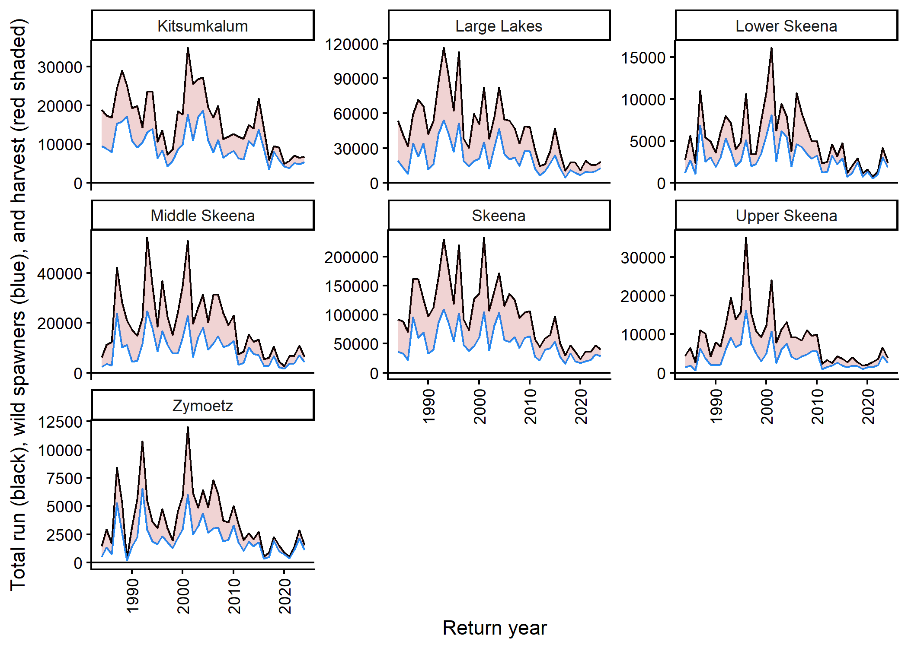

``` r
ggplot( dcsum, aes(y = harvest, x = b)) +
  geom_line() +
  geom_hline(aes(yintercept=0)) +
  ylab(TeX("Total harvest estimate")) +
  xlab("Brood year") +
  #geom_line( aes( y = W) , colour = "dodgerblue") + 
  facet_wrap( ~ i, scales = "free_y") +
  theme_classic() +
  theme(axis.text.x = element_text(angle=90, vjust=0.5))
```

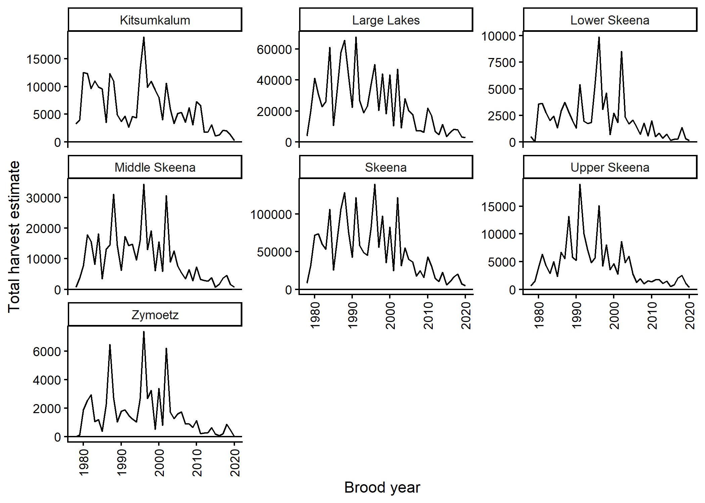
